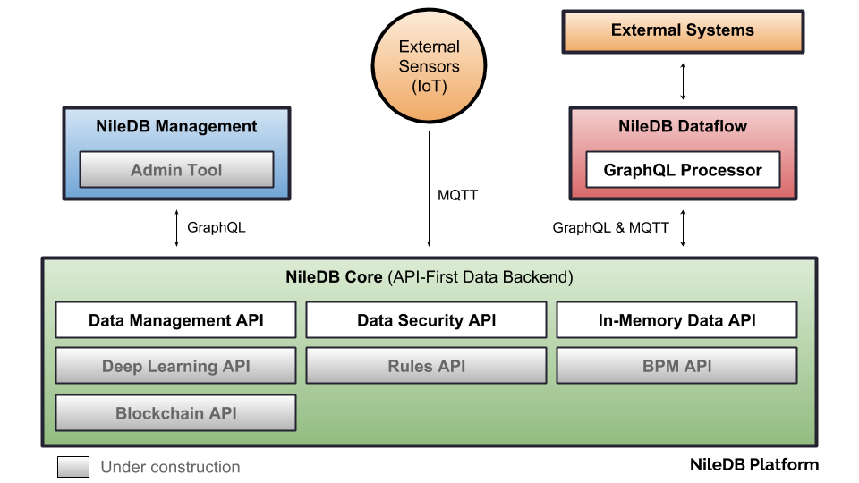

# NileDB Tracker

Android app for sending tracking information to NileDB platform (i.e. Courier agents location, ...).

### Code of Conduct

Please note that this project is released with a [Contributor Code of Conduct](CODE_OF_CONDUCT.md).
By contributing to this project (commenting or opening PR/Issues etc) you are agreeing to follow this conduct, so please
take the time to read it. 

### License

NileDB Tracker is licensed under the GNU General Public License v3.0. See [LICENSE](LICENSE.txt) for details.

Copyright (c) 2018, NileDB, Inc.

[NileDB Tracker License](LICENSE.txt)
